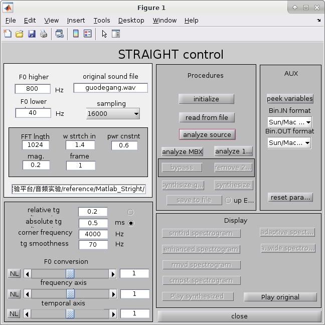
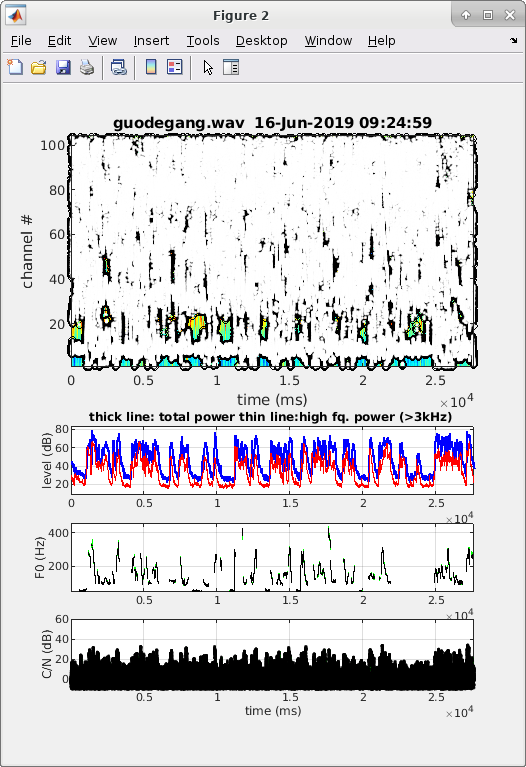
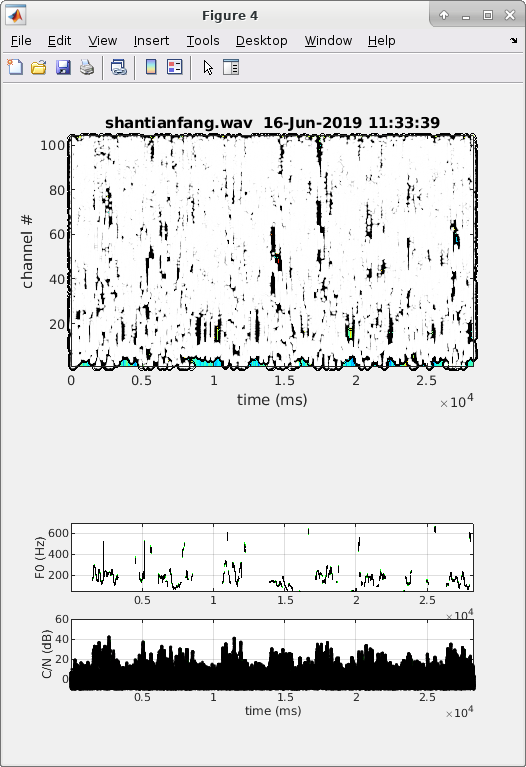
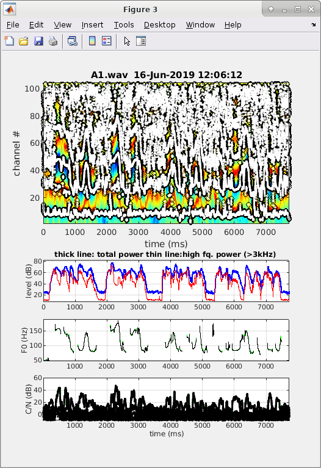
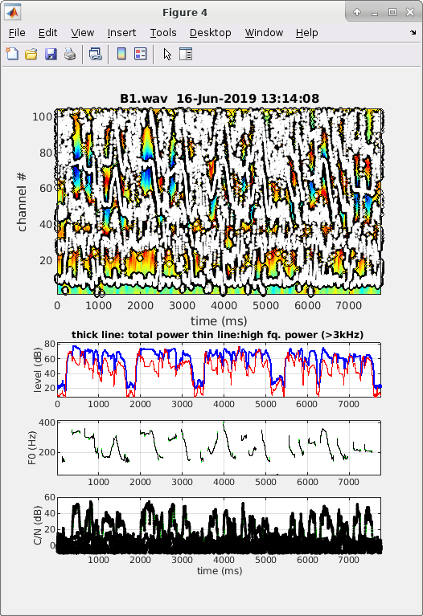
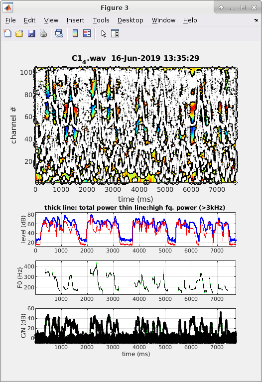
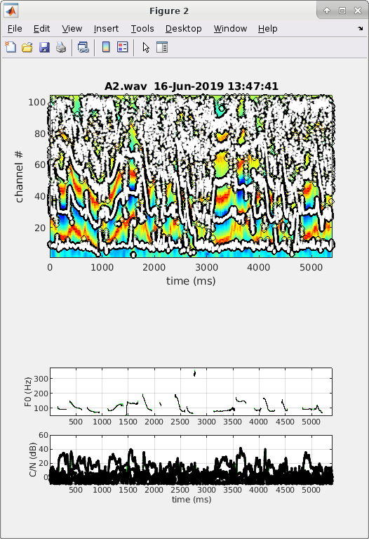
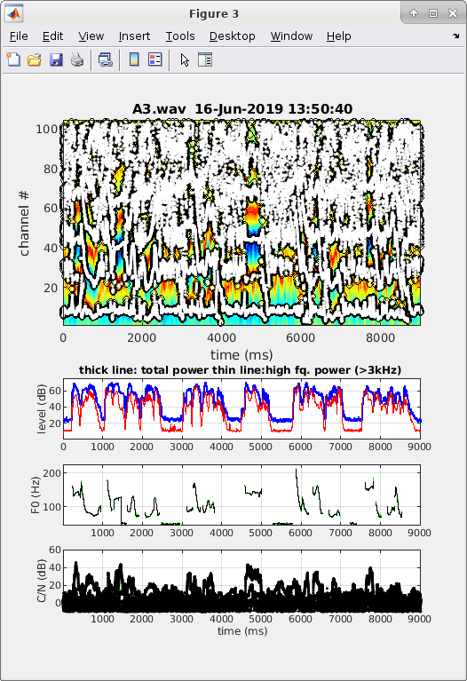
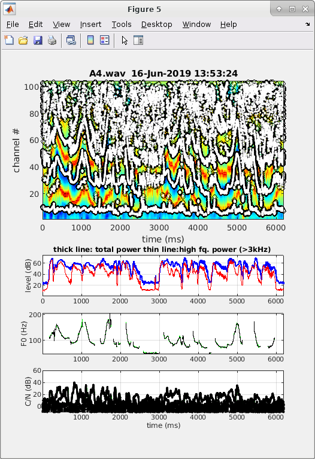
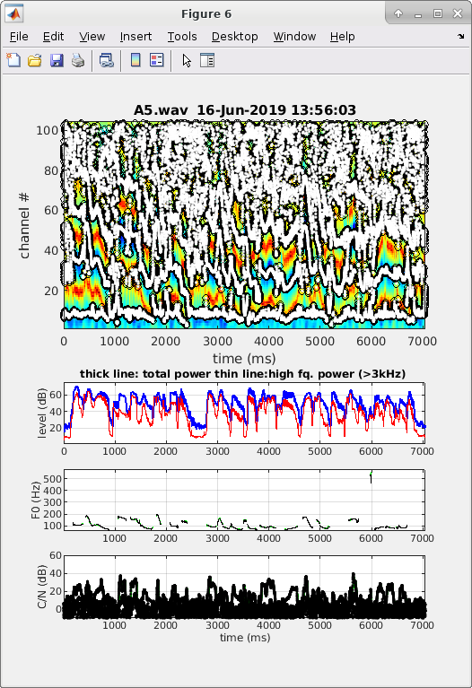

# 多媒体技术音频实验— 声音转换与评价

## 实验1：A to X 声音转换

### 实验要求

把给定的郭德纲和单田芳的两端声音转换成不同的声音。

### 实验过程

按照提供的 MATLAB STRAIGHT 工具箱和步骤进行，下面是一些截图：


STRAIGHT 加载文件的界面



分析得到的各个图。从基频曲线可以基本对应到说的每个字的音调。

下面是单田芳的：



由于 STRAIGHT 有 BUG，第二个图有时候会跑到别的 Figure 中，所以这里没有出现。

### 实验结果

对两段声音都做了很多参数的调整，文件名格式如下：

results/{guodegang,shantianfang}{\_fx.x}{\_freqx.x}{_tempx.x}.wav

分别代表原声音、F0 的调整、Frequency Axis 的调整和 Temporal Axis 的调整。对于每段声音，都做了 8 段转换，综合了只改变单个参数、三个都改变的情况。各个参数的调整的结果都比较清晰，得到预期的结果。

## 实验2：A to B 声音转换

### 实验要求

给定原始声音A和目标声音B的5句话，把A转换为接近B的声音。

### 实验过程

我把数据重命名为 A{1,2,3,4,5}.wav 和 B{1,2,3,4,5}.wav 。首先分析了 A1 和 B1 的各个特征：





由于说的是同一句话，可以看到很多特征上是很相似的，但由于一个是男声一个是女声，所以接下来就需要进行一些参数的调整。

我经过了四次调整，分别是从A1通过调整不同的参数得到results/C1_{1,2,3,4}.wav ，并且取最接近的 C1_4.wav 的对应参数为最终用于转换的参数：F0 2.1878 Frequency Axis 1.2457 Temporal Axis 1 。

这个是 C1_4 对应到特征：



在 F0 曲线上与 B1 已经比较相似了。

接着，我按照同样的参数，转换了 B{2,3,4,5}.wav 到 results/C{2,3,4,5}.wav 。不过，对于部分结果，听起来的效果就没有B1 和 C1 那样接近，说明对于不同的句子，可能用不同的参数会更得到更好的效果。下面是 A{2,3,4,5}.wav 的特征图：









由于是不同的句子，它们的特征就显得不大一样。有时候，F0曲线会出现偶尔的不稳定的情况，导致突然出现一个很大的值，例如上面 A5 的 6000 附近。

### 实验结果

得到了男声向女生转换后的 5 个 音频文件 results/C_{1,2,3,4,5}.wav 。听起来确实像女生的声音，但是和 B 的对应音频在一些字的语气上还不大一样。

## 实验3：声音转换评价

### 实验要求

按照一定的声音度量准测，度量前两个实验得到的各个声音之间的距离，然后验证上面实验的效果。

### 实验过程

调研了一下已有的提取声音特征的一些算法，没有选择 F0 ，而是选择了 MFCC （Mel-frequency cepstrum coefficients） 和 FBank 两个音频特征。特征的提取选择了 Python 的 python_speech_features 库，它的安装方法：

```
pip3 install python_speech_features
```

实际比较两段声音的距离的方法在 results/distance.py 中：

```python
from python_speech_features import mfcc
from python_speech_features import logfbank
import scipy.io.wavfile as wav
import numpy as np
from scipy.stats import energy_distance
import sys

(rate1,sig1) = wav.read(sys.argv[1])
A = mfcc(sig1,rate1)
fbank_feat1 = logfbank(sig1,rate1)

(rate2,sig2) = wav.read(sys.argv[2])
B = mfcc(sig2,rate2)
fbank_feat2 = logfbank(sig2,rate2)

if A.shape[0] < B.shape[0]:
    A = np.vstack((A, np.zeros((B.shape[0] - A.shape[0], 13))))
elif A.shape[0] > B.shape[0]:
    B = np.vstack((B, np.zeros((A.shape[0] - B.shape[0], 13)))) 

print('mfcc dist:', np.sqrt(np.sum((A - B) ** 2)))
print('fbank dist:', energy_distance(fbank_feat1.flatten(), fbank_feat2.flatten()))
```

由于 MFCC 得到的是一个二维矩阵，我采用了二范数作为距离；Fbank得到的是能量，于是我采用了 scipy 提供的能量距离的公式。

### 试验结果

下面是在一些音频上得到的距离的结果：

实验1：

与 shantianfang.wav 的距离：

| 参数                    | MFCC | FBank |
| ----------------------- | ---- | ----- |
| F0=0.6                  | 1492 | 1.04  |
| F0=1.5                  | 1626 | 0.95  |
| Freq=0.6                | 4164 | 1.45  |
| Freq=1.3                | 3687 | 0.75  |
| Temp=0.4                | 3386 | 0.95  |
| Temp=1.3                | 3827 | 1.06  |
| F=0.7,Freq=1.2,Temp=1.3 | 4172 | 0.86  |
| F=1.5,Freq=0.8,Temp=0.4 | 3582 | 1.12  |

可以看到，不同的修改对距离的影响也是不一样的。对于MFCC来说，F0对它的影响不大，但是Freq和Temp的影响都比较大，使得距离比较大。FBank则比较玄学，没有看出一定的规律来。

实验2：

对比转换前后与目标 B1.wav 的距离：

| 音频                | MFCC | FBank |
| ------------------- | ---- | ----- |
| 男声(A1)            | 1894 | 0.37  |
| 转换1（C1_1）       | 1892 | 0.17  |
| 转换2（C1_2）       | 1896 | 0.18  |
| 转换3（C1_3）       | 1752 | 0.16  |
| 最终转换（C1/C1_4） | 1747 | 0.16  |

可以看到，随着不断调整，确实转换后的和目标音频的距离在减小，符合人听的效果的不断接近。

其余音频转换前后的距离：

| 音频   | MFCC | FBank |
| ------ | ---- | ----- |
| B2, C2 | 1532 | 0.25  |
| B3, C3 | 2236 | 0.38  |
| B4, C4 | 1769 | 0.49  |
| B5, C6 | 1697 | 0.73  |

可以看到，即使是同样生成出来的数据、同样的转换参数，得到的转换结果与预期结果之间的距离也差异比较大。这可能意味着，目前的距离的衡量，对于同一段音频比较符合真实情况，但是不能保证不同音频之间横向比较的结果。可能需要进行进一步的标准化等操作后，才可以达到这个效果。

